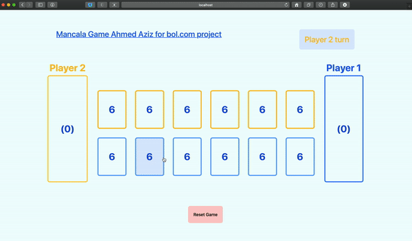
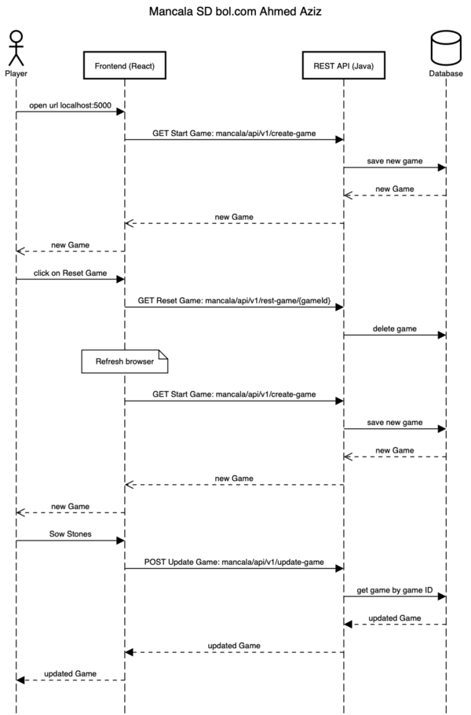

# Mancala Game Ahmed Aziz for bol.com project

This project is part of the bol.com job application for Ahmed Aziz.

## Tech Stack
**Client:** React, TailwindCSS

**Server:** Java 11, Spring boot, Spring WEB, Lombok, JPA, H2

## Run Locally

Clone the project
```bash
  git clone https://gitlab.com/bolcom/ahmed-aziz.git
```
Go to the project directory
```bash
  cd ahmed-aziz
```
Build the application
```bash
  mvn clean package
```
Start the server
```bash
  mvn spring-boot:run
```
Application will start on 
[localhost:5000](http://localhost:5000)

## API Reference

| Rest Method | EndPoint                              | Description     |
| :-------    | :--------                             | :-------------- |
| `GET`       | `/mancala/api/v1/create-game`         | Start the Game  |
| `DELETE`    | `/mancala/api/v1/delete-game/{gameId}`| Delete the Game |
| `POST`      | `/mancala/api/v1/update-game`         | Update the Game |

## Demo


## Sequence Diagrams


## Features
1. The stones can be adjusted in the [property file](src/main/resources/application.yml). Currently, it is set to 6.
1. The Player opens the web app URL in the browser, localhost:5000. The first player turn will be randomly generated.
   1. Spring boot will serve the front-end files in the static directory and show them in the browser. It uses a maven front-end plugin that will take care of building the React front-end application and place it in the correct static directory.
   1. When the front-end be loaded in the browser, it will make an immediate REST call to get a new game by calling the endpoint mancala/api/v1/create-game.
   1. The game will be loaded and ready to play.
1. The Player may reset the game any time he/she wants. Resetting the game means technically:
   1. Deleting the game from the database in the back-end.
   1. Refreshing the browser in the front-end and getting a new game.
1.  If the customer chooses one of his/her pits, a request will be sent to the backend with the selected pit name, and game ID.
1. If the player didn't choose one of his/her pits, an error will occur with the message: "Please choose your pits!".
1. The player can't choose the Big pits from the front-end. But, if there is a request done via curl, postman, or something else, with the big pit index, an error will occur with the message: "Please use another Pit! The Big one is not allowed to be used".
1. The player can't choose outside the game pits size range. But if there is a request done via curl, postman, or something else, without index, an error will occur with the message: "The selected index is not within the game range!".
1. If the player chooses the correct pits:
    1. The game ID will be sent to the backend to retrieve the game from the database.
    1. The stones will be taken from the selected pit so that the selected pit will be emptied.
    1. One stone will be added to each next pit till there are no stones left. Big pits will be skipped for the opponent player.
    1. If the loop end at the last index of the game, and there are still stones left, restart the index to zero.
    1. The next player will be the opposite of the current player. Only if the last stone end at the own big pit of the player, he/she may have one more turn.
    1. At the end of the turn and before returning the updated game, the game will check for the winner. It checks the list of the pits of each player if they are empty. If one of the pit lists of one of the players is empty, compare the total amount of each big pit,
     the one who has the most amount of stones wins. The sum will be counted based on all the stones available. So even if player 1 ends the game and player 2 has in total (big pit + all the stones in the other pits) is more than player 1 big pit, player 2 wins. 
    1. If the count of the stones is equal for both big pits, the one who ends the game wins.
    1. If there is a winner, that means the game will end, and the application will delete the game from the database. It will return an updated game response with a filled field "PlayerWinner". The front-end will be checking this field for every response,
     and when it finds that this field is filled, it will show the winning message to the players with the winner player and end the game.
    1. If there is no winner, the application will save the game in the database and return the list of the updated game to the frontend. The "PlayerWinner" field will remain empty.

## Author: Ahmed Aziz
- [Linkedin](https://www.linkedin.com/in/ahmedaziz83/)
- [GitHub](https://github.com/ahmeed83/)
- [Twitter](https://twitter.com/AA_ziz/)
